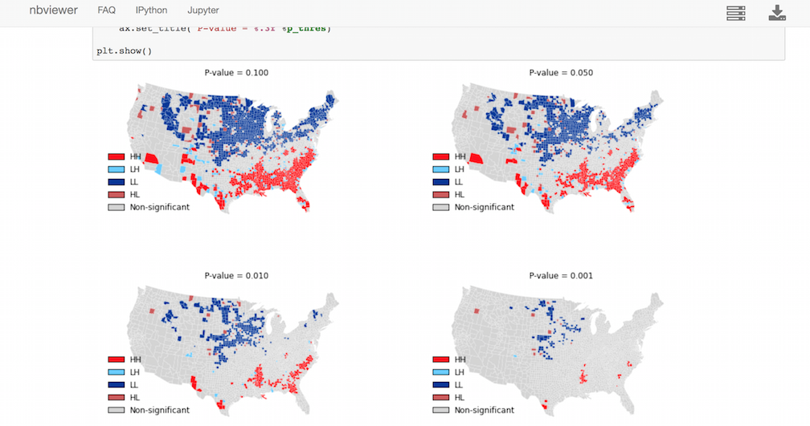

Python Spatial Analysis Library
===============================

.. |build| image:: https://travis-ci.org/pysal/pysal.png
   :scale: 100%
   :align: middle
   :target: https://travis-ci.org/pysal/pysal
.. |cover| image:: https://coveralls.io/repos/pysal/pysal/badge.svg?branch=master
   :scale: 50%
   :align: top
   :target: https://coveralls.io/r/pysal/pysal?branch=master
.. |docs| image:: https://readthedocs.org/projects/pysal/badge/?verison=latest
   :scale: 50%
   :align: top
   :target: http://pysal.readthedocs.org/en/latest/ 
.. |talk| image:: https://badges.gitter.im/Join%20Chat.svg
   :scale: 50%
   :align: top
   :target: https://gitter.im/pysal/pysal?

+---------+---------+---------+---------+
| |build| | |cover| | |docs|  | |talk|  |        
+---------+---------+---------+---------+

PySAL_ is an open source cross-platform library of spatial analysis functions
written in Python. It is intended to support the development of high level
applications for spatial analysis.

It is important to underscore what PySAL is, and is not, designed to do. First
and foremost, PySAL is a library in the fullest sense of the word. Developers
looking for a suite of spatial analytical methods that they can incorporate
into application development should feel at home using PySAL. Spatial analysts
who may be carrying out research projects requiring customized scripting,
extensive simulation analysis, or those seeking to advance the state of the art
in spatial analysis should also find PySAL to be a useful foundation for their
work.

End users looking for a user friendly graphical user interface for spatial
analysis should not turn to PySAL directly. Instead, we would direct them to
projects like  the GeoDaX_ suite of software products which wrap PySAL
functionality in GUIs. At the same time, we expect that with developments such
as the Python based plug-in architectures for QGIS, GRASS, and the toolbox
extensions for ArcGIS, that end user access to PySAL functionality will be
widening in the near future.

.. _PySAL : https://github.com/pysal/pysal/
.. _GeoDaX : https://geodacenter.asu.edu/software

PySAL package structure
-----------------------

Currently PySAL consists of the following files and directories:

  LICENSE.txt
    PySAL license.

  INSTALL.txt
    PySAL prerequisites, installation, testing, and troubleshooting.

  THANKS.txt
    PySAL developers and contributors. 

  README.txt
    PySAL structure (this document).

  setup.py
    Script for building and installing PySAL.

  MANIFEST.in
    Additions to distutils-generated PySAL tar-balls.

  CHANGELOG.txt
    Changes since the last release

  pysal/
    Contains PySAL __init__.py and the directories of PySAL modules.

  doc/
    Contains PySAL documentation using the Sphinx framework.

PySAL modules
-------------

* pysal.cg  Computational geometry
* pysal.contrib  Contributed modules
* pysal.core  Core data structures and IO
* pysal.esda  Exploratory spatial data analysis
* pysal.examples  Data sets
* pysal.inequality  Spatial inequality analysis
* pysal.network  Spatial analysis on networks
* pysal.region  Spatially constrained clustering
* pysal.spatial_dynamics  Spatial dynamics
* pysal.spreg  Regression and diagnostics
* pysal.weights  Spatial weights

Website
-------
All things PySAL can be found here
    http://pysal.org/

Mailing Lists
-------------
Please see the developer list here
    http://groups.google.com/group/pysal-dev

Help for users is here
    http://groups.google.com/group/openspace-list

Bug reports
-----------
To search for or report bugs, please see
    http://github.com/pysal/pysal/issues

License information
-------------------
See the file "LICENSE.txt" for information on the history of this
software, terms & conditions for usage, and a DISCLAIMER OF ALL
WARRANTIES.
