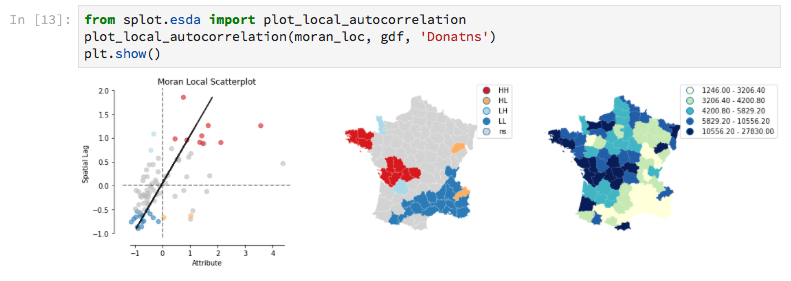

# splot

**Lightweight plotting and mapping to facilitate spatial analysis with PySAL.**

## What is splot?

`splot` connects spatial analysis done in [`PySAL`](https://github.com/pysal) to different popular visualization toolkits like [`matplotlib`](https://matplotlib.org).
The `splot` package allows you to create both static plots ready for publication and interactive visualizations for quick iteration and spatial data exploration. The primary goal of `splot` is to enable you to visualize popular PySAL objects and gives you different views on your spatial analysis workflow.

If you are new to splot and PySAL you will best get started with our documentation!

## Installing splot

### splot requires:

splot is compatible with `Pytho`n 3.5 or later and depends on `geopandas` 0.4.0 or later and `matplotlib` 2.2.2 or later.

splot aslo uses
* `numpy`
* `seaborn`
* `mapclassify`
* `Ipywidgets`

Depending on your spatial analysis workflow and the PySAL objects you would like to visualize, splot relies on:
* PySAL 2.0 2rc
or separate packages:
* esda
* libpysal
* spreg
* giddy

### Quick install:

There are two main ways of accessing splot. First, the overall library install of PySAL 2.0 includes splot.
PySAL 2.0 will be available from PyPI or Anaconda by the beginning of September 2018:

    $ pip install pysal
    
    or 
    
    $ conda install -c conda-forge pysal

Second, splot can be installed separately. If you are using Anaconda, install splot via the conda utility:

    $ conda install -c conda-forge pysal

Otherwise you can install splot from PyPI with pip:

    $ pip install splot

## Contributing to splot

`splot` is an open source project within the Python Spatial Analysis Library that is supported by a community of Geographers, visualization lovers, map fans, users and data scientists. As a community we work together to create splot as our own spatial visualization toolkit and will gratefully and humbly accept any contributions and ideas you might bring into this project. 

Feel free to check out our dicussion spaces, add ideas and contributions:
* [Idea collection](https://github.com/pysal/splot/issues/10) which PySAL objects to support and how new visualizations could look like
* [Discussion](https://github.com/pysal/splot/issues/9) about the splot API
* Ideas how to integrate [other popular visualization toolkits](https://github.com/pysal/splot/issues/22) like `Bokeh` or `Altair`

If you have never contributed before or you are just discovering what PySAL and splot have to offer, reading through """Doc-strings""" and correcting our Documentation can be a great way to start. Check for spelling and grammar mistakes or use [pep8](https://pypi.org/project/pep8/) and [pyflakes](https://pypi.org/project/pyflakes/) to clean our `.py` files. This will allow you to get used to working with [git](https://try.github.io) and generally allows you to familiarize yourself with the `splot` and `PySAL` code base.

If you have already used PySAL and splot and you are missing object-specific views for your analysis feel free to add or discuss your ideas to our code-base. Please make sure you include unit test, documentation and examples or (create an issue so someone else can work together with you). The common `splot` API design discussed [here](https://github.com/pysal/splot/issues/9) can help you to decide how to best integrate your visualization prototype into `splot`.

Beyond working on documentation and prototyping new visualizations you can always write a bug report or feature request on [Github issues](https://github.com/pysal/splot/issues). Whether large or small, any contribution makes a big difference and we hope you enjoy beeing part of our community as much as we do!

## Community support

* [PySAL 2.0](http://pysal.org)
* [Gitter chat splot](https://gitter.im/pysal/splot?utm_source=badge&utm_medium=badge&utm_campaign=pr-badge&utm_content=badge)
* [Gitter chat pysal](https://gitter.im/pysal/pysal?)
